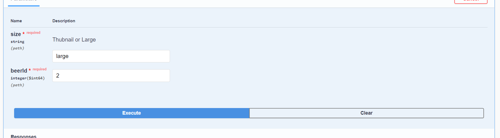

# Assignment Two

## API Documentation

<http://localhost:8888/swagger-ui/index.html>

## Evaluation

I am using the swagger UI to show each functionality of the API that has been created and working so far(Postman is also optional for this as well).


Let's start by discussing the getBeerById function. So one running it will display all the details of a single beer by typing in its id.  Then once executing it will display the following:

It will also include a link.

Next is displaying all the beers along with their details and two different links. Because of the Swagger issue for not executing the function the Postman would be the next best option just in case this might happen. 

As shown in the image above, the getBeers function will display all the beers along with their details and two different links which are the self link and another that would display a beer's name and description as well as the associated brewery.

Now then let's discuss the getting breweries map location function.  

By filling an id to any brewery then executing it will display an html script brewery's location a map along with its details. 

When displaying it on the browser:


The QR code function (which is after the map) will display a QR code of the brewery's contact details. Similar to the map by typing a brewery's id then execute will display the QR code then by scanning the code with brewery's contact details gets added to your phone.


The function shown in the image above is used to a zipped folder for beers images. So when executing it will display a download link for the zipped folder.

When clicking on the download link it will download the zipped folder that contains these images.


So now moving on to demonstrate the getting beer's thumbnail or large images.

In the image above shows then it consists of if/else feature that when choosing either large or thumbnail of a beer based on its id it will display the image of either of them. 
For large:


For thumbnail:


After images comes the PDF. The issue with PDF's functionality however is that the data in the database is not consistent. So a fix was added to cope with the missing style i.e. -1
```java
Style style = beer.getStyle_id() == -1 ? null : styleRepository.findById(beer.getStyle_id()).get();
```


Similar to downloading the zipped folder of images it will download a pdf of the beer's description.

An Example of pagination is on the BeerController class. It allows you to download  as much or little of the data as you need.

## Benchmarks and Enhancements

Why is a benefit to add a REST API? 

It separates the data from the presentation layer/logic and allows you to create a RESTful API that can be consumed by any client.

Hateaos implementation is not a great investment of development time.
While it is claimed it separates the client / server coupling with the links, add one parameter to your REST API and you will have to change the client.  

Future Enhancements:

Implement API Versioning 
If a client is not able to handle a certain version of the API, it can be changed to a different version.